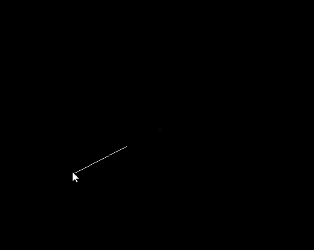
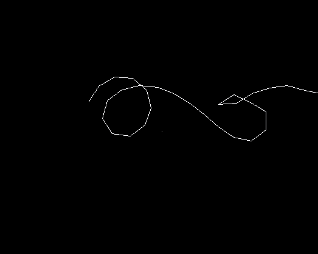
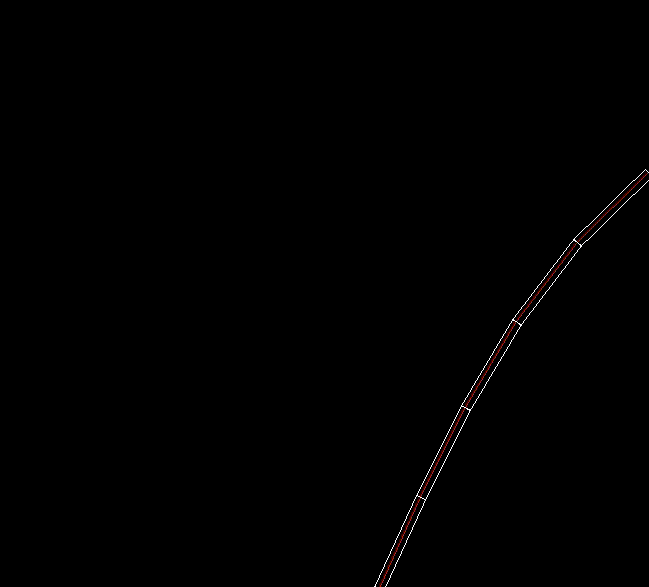

# FABRIK Inverse Kinematics (fabrik)

Proof-of-concept implementation of the [FABRIK algorithm](FABRIK.pdf) (Forward And Backward Reaching Inverse Kinematics).

## License

This is free and unencumbered software released into the public domain. See the [UNLICENSE](UNLICENSE) file for more details.
